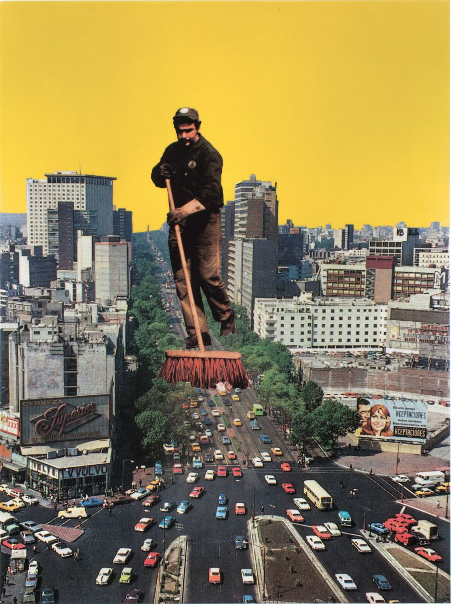
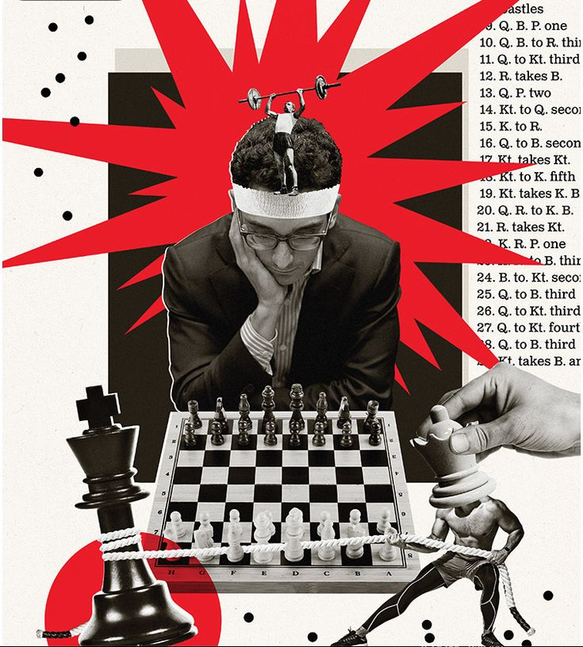
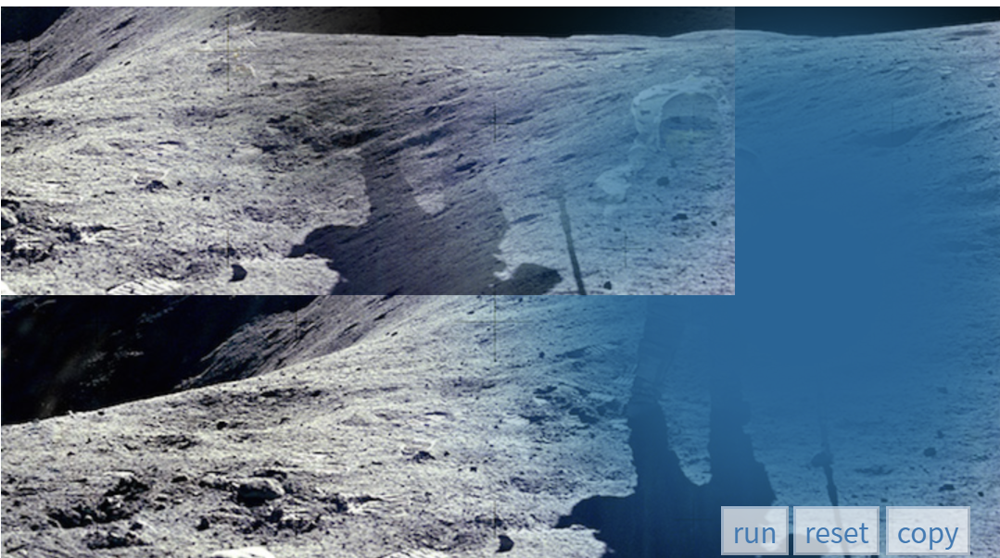

# Week 8 Quiz

## Imaging Technique Inspiration - Montage
I found inspiration in Guillaume Chiron’s collage poster designs on Pinterest. His use of cut-out newspaper elements and layered textures creates a playful yet thought-provoking aesthetic. The **montage** technique combines fragmented images into a coherent composition, giving the work both depth and narrative tension. I believe incorporating this approach into my project could enhance its visual impact by adding richness and a handmade feel. It would also help communicate abstract ideas in a more engaging way, aligning with the creative and experimental direction of the assignment.

**Example images:**  

## Coding Technique Exploration - p5.js Masking + Blend Modes
Using **p5.js** can help me bring the collage idea into a digital form. The functions **mask()** and **blendMode()** make it possible to cut shapes and layer different images, similar to how paper collage works. With **createGraphics()**, I can manage each layer on its own, then combine them together. This gives me freedom to try many textures and layouts quickly. It also makes the design look handmade but still flexible to change, which matches the style of Guillaume Chiron’s posters.
**Example Screen shot and code link:**  
[p5.js mask reference](https://p5js.org/reference/#/p5.Image/mask)  

